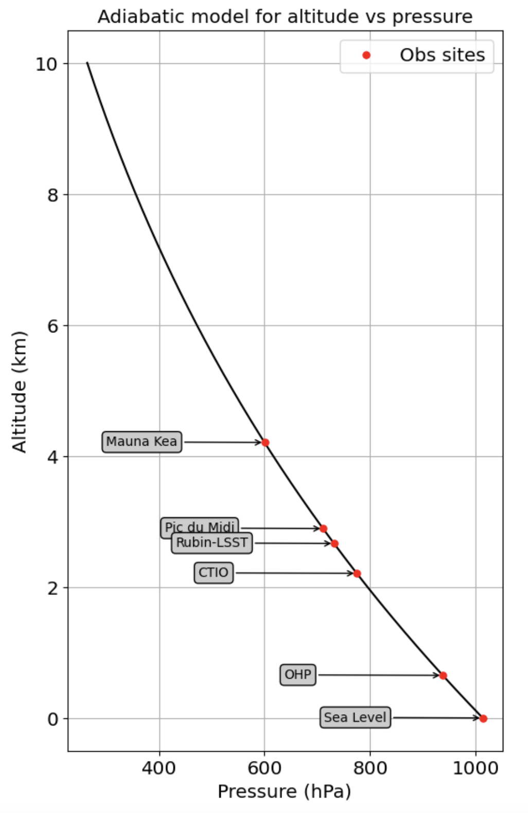

Introduction
============

Goal
----

This package provide a fast emulator of atmospheric transmissions. These transmissions depend on the observation site,
the wavelength, the airmass, the pressure and the atmospheric content in precipitable water vapor, ozone and aerosols.

Whereas for aerosols scattering, a single component is assumed using an analytic formula, the other processes
are extracted from [libradtran](http://www.libradtran.org) simulations.

Transmission pattern for 5 observation sites are proposed: ``LSST``, ``CTIO``,
``OHP`` (observatoire de Haute Provence, Fr),
``PDM`` (observatoire du Pic du Midi, Fr),
``OMK`` (Mauna Kea Observatory),
``OSL`` (at sea level).

============= ======== ========== =========== ========= =========== ========= 
**Obs site**  **LSST**  **CTIO**    **OHP**    **PDM**   **OMK**     **OSL**  
------------- -------- ---------- ----------- --------- ----------- ---------
 pressure-hPa  731.5    774.6       937.2      710.9      600.2      1013.0 
 altitude-km   2.663    2.207       0.650      2.891      4.205         0.0 
============= ======== ========== =========== ========= =========== =========

The altitude-pressure dependence is shown on the figure below:

If you don't find your observation site, choose the site having the closest altitude 
and provides the effective ground pressure.

The transmissions will be pressure corrected for the corresponding ground pressure.         

illustration
------------

The following figure shows the atmospheric air transparency profiles provided by ``AtmEmulator``.

.. figure:: images/getObsAtmo.png
    :width: 800

