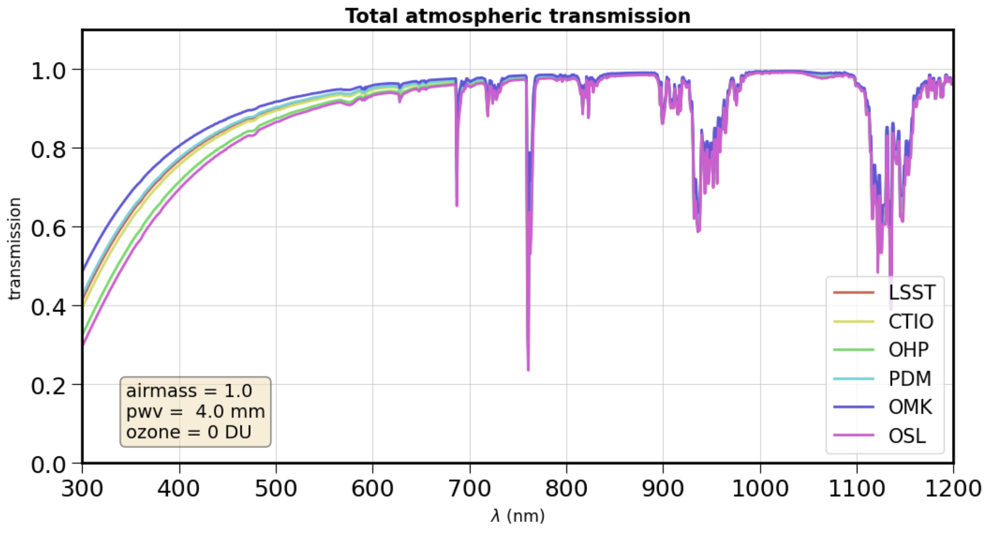

Introduction
============

Goal
----

This package provides a simplified python library package called ``libradtranpy``` 
to access easily to ``libRadtran`` by offering a simplified user interface library to ``libRadtran``.

``libRadtran`` is library for radiative transfer providing a collection of C and Fortran 
functions and programs for calculation of solar and thermal radiation in the Earth's atmosphere. libRadtran is freely available under the GNU General Public License.
The main Authors are Bernhard Mayer, Claudia Emde, Josef Gasteiger, and Arve Kylling. 
``LibRadtran`` simulation package can be downloaded from the 
`libRadtran web site <http://www.libradtran.org/>`_ .


.. figure:: images/libradtran.png
   :width: 200


The library ``libradtranpy`` generate the libradtran configuration file which is processed by ``libRadtran`` in a standalone mode.
It return the path of the output file generated by ``libRadtran`` in the format expected: two column
table, one for the wavelength, the second with the air transmission.

This library ``libradtranpy`` consists mainly in one function with a number of input parameters which definition
are given in this documentation.

* ``libsimulateVisible.ProcessSimulation()`` 


The ``libsimulateVisible`` module refers to the ``libRadtran visible running mode`` which applies
in the light visible range by contrast to the ``libRadtran thermal running mode`` which applies in the
infrared range.

(A ``libsimulateThermal`` could be provided in a later version of ``libradtranpy``).

The wavelength range available in ``libradtranpy`` is 300.0 nm - 1200.0 nm (by hardcoding, hoever
it could be modified to be configurable in later versions). 


An example of air transmission at different observation sites is shown below:




Main parameters
---------------

Altitude parameter
``````````````````


An essential parameter is the observation altitude. Thus in our interface, wa have preselected
six observation sites:


Transmission pattern for 5 observation sites are predefined: 
``LSST`` (Rubin-LSST observatory in Chile), 
``CTIO``,(Cerro Tololo Inter-American Observatory),
``OHP`` (Observatoire de Haute Provence, Fr),
``PDM`` (Observatoire du Pic du Midi, Fr),
``OMK`` (Mauna Kea Observatory),
``OSL`` (Sea level).

These observation site sample well the altitude-ground pressure range of interest for any other 
observation site.

============= ======== ========== =========== ========= =========== ========= 
**Obs site**  **LSST**  **CTIO**    **OHP**    **PDM**   **OMK**     **OSL**  
------------- -------- ---------- ----------- --------- ----------- ---------
 pressure-hPa  731.5    774.6       937.2      710.9      600.2      1013.0 
 altitude-km   2.663    2.207       0.650      2.891      4.205         0.0 
============= ======== ========== =========== ========= =========== =========

The altitude-pressure dependence is shown on the figure below:

.. figure:: images/libradtranpy_altitudevspressure.png
    :width: 400


If you don't find your observation site, choose the site having the closest altitude 
and provides the effective ground pressure.

Libradtran will scale the atmospheric profile to the input ground pressure given by the user.


other parameters
````````````````

airmass parameter
~~~~~~~~~~~~~~~~~
The airmass parameter is translated in solar zenith angle for ``libRadtran``.


Precipitable water vapor
~~~~~~~~~~~~~~~~~~~~~~~~~
Vertical Precipitable water vapor column depth in mm.

Ozone column depth
~~~~~~~~~~~~~~~~~~~
Vertical Ozone column depth in Dobson Unit. 

Pressure
~~~~~~~~
Ground pressure at the observation site. If not null, this value override the standard
pressure expected for the altitude of the selected observation site.


Aerosols
~~~~~~~~~~
aer_num,angstrom_exponent_num are respectively the VAOD and the Angtrom parameter,where the VAOD is at wavelength 500 nm.

atmospheric profile
~~~~~~~~~~~~~~~~~~~

defines the type of atmosphere, such standard us atmosphere, 
mid latitude summer, mid latitude winter, tropical,.., default standard us 

Interaction processes
~~~~~~~~~~~~~~~~~~~~~

Activation of different processes light-air interaction, like scattering and absorption (sa), absorption only (ab), scattering only (sc),..,
default scattering and absorption (sa)


Cloud depth
~~~~~~~~~~~
Vertical Cloud optical depth. (It is recommended not to use it, better apply a grey attenuation to
all wavelength transmission).


