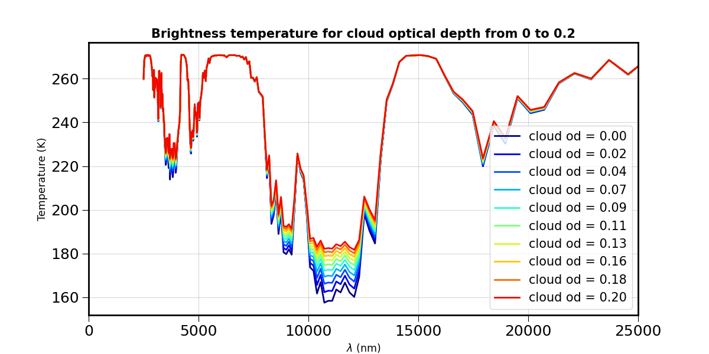
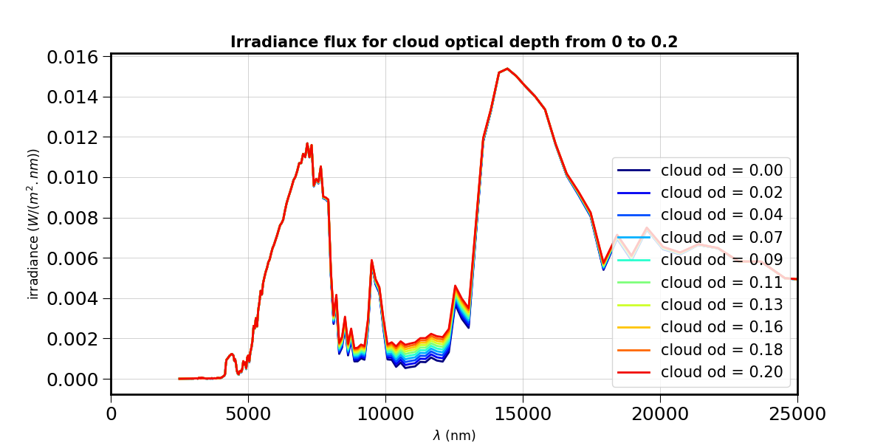

Quickstart for thermal mode
===========================
      


Usage
-----


Usage in a shell script
```````````````````````

if **libradtranpy/src/libradtranpy/libsimulateThermal.py** is in the python path:
	

    libsimulateThermal.py  [-v] -z <airmass> -w <pwv> -o <oz> -p <P> -c <cld> -m<mod> -q<proc> -s<site-string> -v<verbose-flag>
 	 - z   : airmass from 1.0 to 3.0, typical z=1
 	 - pwv : precipitable watr vapor in kg per m2 or mm, typical pwv = 5.18 mm
 	 - oz  : ozone in Dobson units from 200 DU to 400 DU
 	 - p   : Pressure in hPa, typical P=775.3 hPa
 	 - c   : Cloud vertical optical depth, typical c=0
 	 - m   : Atmospheric model, typical m='us'
 	 - q   : Interaction processes, typical q='sa' for scattering and absorption
 	 - s   : provide site or altitude as a string : LSST/OHP/PDM/OMK/OSL or altitude in km like akm_2.663
 	 - v   : activate libradtran output verbose mode
 	 - t   : thermal output selected among (brightness,radiance,irradiance,irradiance_integrated,transmisstance). Optional. Default brightness
	 Examples :
	 	 1) python libsimulateThermal.py -z 1 -w 0 -o 0 -s LSST
	 	 2) python libsimulateThermal.py -z 1 -w 4 -o 300 -c 0 -p 742 -m us -q sa -s LSST -t irradiance
	 To generate ascii printout of the used atmospheric model tables in a log file :
	 	 python libsimulateThermal.py -v -z 1 -w 0 -o 0 -s LSST >& output.log
	 Actually provided :
	 	 Number of arguments: 2 arguments.
	 	 Argument List: ['libsimulateThermal.py', '-v'] 

Outputs of libradtran
~~~~~~~~~~~~~~~~~~~~~

* ``Librandtran`` generates output acii files consisting of rows of (wavelength, transmission).
 
* ``librandtranpy`` manages the different simulations and their output files in a hierarchical directories. The top level directory is **simulations/**.

The output of libradtran can be found in subdirs of 
``simulations/RT/2.0.5/observationsite/pp/``.

	 	 
	 	 
Use of libradtranpy as python package library
`````````````````````````````````````````````````

The call of libradtran through libradtranpy can be done as follow:

    from libradtranpy import libsimulateThermal
      


    path,thefile=libsimulateThermal.ProcessSimulation(am[index],pwv,ozone,pressure,
                prof_str='us',proc_str='sa',cloudext=cloudext,altitude_str="LSST",thermal_output="brightness")


where the argument ``thermal_output`` specifies the type of output required
among :
* sky brightness (temperature)
* irradiance,
* integrated irradiance,
* radiance,
* transmittance.

* ``path,thefilename`` are the path and filename of the output ascii file.

The result of the simulation can be obtained by:

        data = np.loadtxt(os.path.join(path,thefile))
        wl = data[:,0]
        atm = data[:,1]                                                 
                                                      





 


Remarks on the documentation on readthedocs
```````````````````````````````````````````


As ``libRadtran`` is not installed on ``readthedocs`` computer, the following example
below cannot appear.

The access is shown as follow:

These are detailed in :doc:`apidocs`.

.. code::
   >>> import os
   >>> import numpy as np
   >>> from libradtranpy import libsimulateVisible
   >>> # check libradtran is in your path
   >>> os.getenv('LIBRADTRANDIR')
   >>> am=1.2  # set the airmass
   >>> pwv =4.0  # set the precipitable water vapor in mm
   >>> oz=300. # set the ozone depth on DU
   >>> pressure = 0. # use default value
   >>> cloudext=0 # use default
   >>> path,thefile=libsimulateVisible.ProcessSimulation(am,pwv,ozone,pressure,
         prof_str='us',proc_str='sa',cloudext=cloudext,altitude_str='LSST',FLAG_VERBOSE=False)
   >>> data = np.loadtxt(os.path.join(path,thefile))
   >>> wl = data[:,0]   # wavelength array
   >>> transm = data[:,1] # transmission array

Moreover the ``libradtranpy.libsimulateVisible`` API cannot appear on readthedocs website.
This API may appear on user's computer if ``libRadtran`` is installed correctly. 